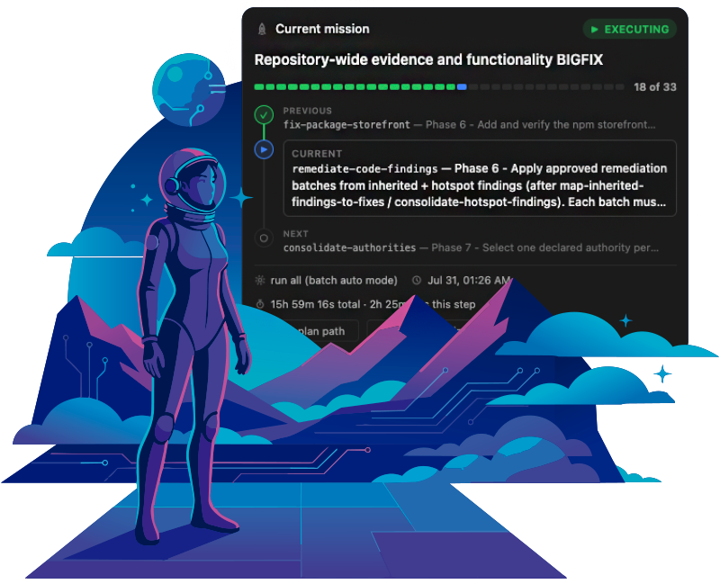
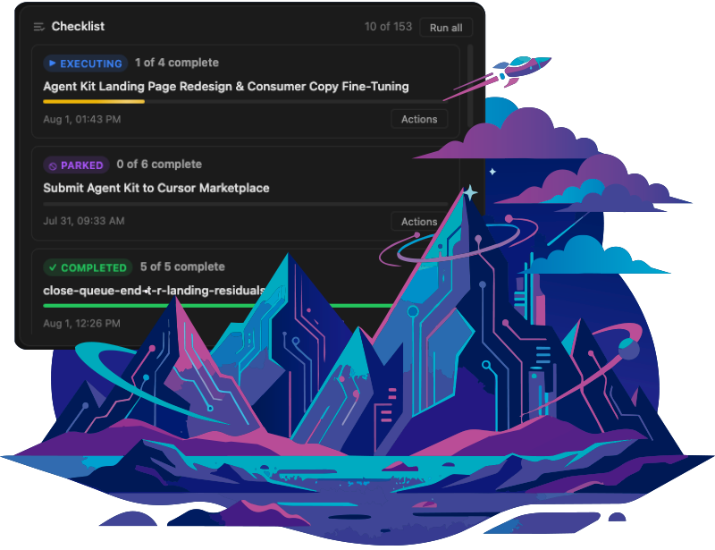
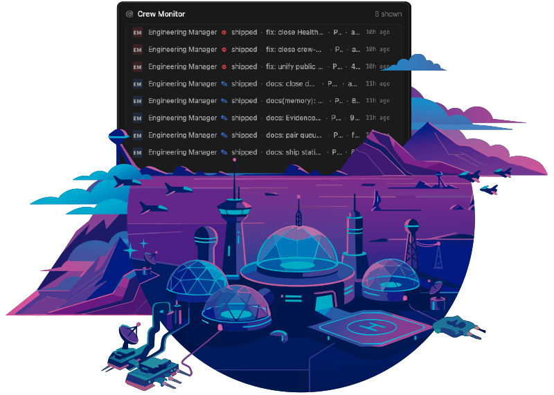
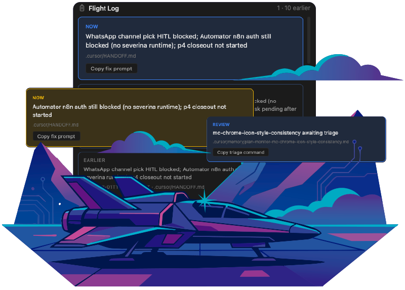

# Mission Kit

[](https://www.npmjs.com/package/@dadado/agent-kit-cli)
[](LICENSE)
[](https://nodejs.org)
[](https://github.com/agent-kit-startup/agent-kit/releases/latest)

<p align="center">
  
</p>

[Watch the demo on YouTube](https://www.youtube.com/watch?v=9mrAg6Mczfg) · [missionkit.io](https://missionkit.io)

**Mission Kit** is the building gear pack for AI coding agent: orchestrated plans with to-dos, human confirmation gates, and a staging-then-prod git flow. You describe the goal: it writes a plan, runs it one unit at a time, and never promotes to production without your explicit yes.

Ships as **Agent Kit** on npm (`@dadado/agent-kit-cli`).

## Install

From your project root:

```bash
npx @dadado/agent-kit-cli@latest install
```

Node.js 20+. Git is recommended; the staging and prod routines depend on it. Use `@latest` so npx does not reuse a stale cached CLI. Pin `@x.y.z` when you need a reproducible install. Non-interactive: add `-y` and `--yes`.

`npx` is ephemeral, so bare `agent-kit` will not be on your PATH yet. If you hit `command not found`, run:

```bash
npx @dadado/agent-kit-cli@latest setup-global
```

or keep prefixing commands with `npx @dadado/agent-kit-cli@latest`.

## Pick your surface

- **Cursor.** The first-class surface. Slash commands land in `.cursor/commands/`: `/start-project`, `/continue-plan`, `/run-plan`, `/git-staging`, `/git-prod`, `/dashboard` and more. Confirmations use Cursor's Ask questions.
- **Claude Code.** Run the kit-load with `--claude`, then `CLAUDE.md` plus `/agent-kit` give you the same contracts. Confirmations fall back to numbered lists.
- **Terminal.** `npx @dadado/agent-kit-cli mission-control` renders Mission Control as a live TUI in your terminal. `--once` prints a single frame and exits. Shipped in 5.6.0.
- **Browser.** `npx @dadado/agent-kit-cli dashboard` serves Mission Control on `127.0.0.1`. LAN sharing is opt-in and token-gated (`dashboard-broadcast`).

Mission Kit is Cursor-first. VS Code and Windsurf get partial config generators, not full parity.

## A normal day

```
/start-project   describe a goal, approve the plan, approve the first unit
/continue-plan   confirm the next to-do, ship one unit, stop
/run-plan        run the active plan to the end or until blocked
/backlog-add     queue a plan for later without activating it
/git-staging     branch, PR, merge to staging
/git-prod        staging to main, only after you say yes
```

Production promotion is never automatic. The kit asks; you answer.

## License

PolyForm Noncommercial 1.0.0. Commercial licensing: sales@missionkit.io.

## Contribute

Skills, docs fixes, and CLI patches are welcome. Start at `docs/CONTRIBUTING.md`.

## Mission Control

A local dashboard over the same workspace state the CLI drives — current mission, checklist, crew activity, and the flight log.

<table>
<tr>
<td width="50%"></td>
<td width="50%"></td>
</tr>
<tr>
<td width="50%"></td>
<td width="50%"></td>
</tr>
</table>


## Usage

1. **Prepare the repository:** `/agent-kit-onboard` - readiness, safe fixes, one decision at a time.
2. **Start a plan:** `/start-project` - describe a goal; confirm the plan, then the first unit.
3. **Work a phase:** the agent implements, saves resume state, and stops (manual mode).
4. **Continue later:** `/continue-plan` in a fresh chat.
5. **Ship to staging:** `/git-staging` - branch, commit, merge to `origin/staging`.

How to drive a plan:

- **`/continue-plan`** - you drive: one phase per chat.
- **`/run-plan`** - the kit drives: runs the plan to the end and stages finished work.
- **`/run-plan-all`** - queue several plans and run them in order after you confirm the queue. That confirm can ship one release per finished plan.

Short chooser: [Getting started](docs/getting-started.md#which-command-next).

**Production safety:** `/git-prod` promotes staging to `main` only after confirmation. Direct commits to `main` are blocked.

### Mission Control (local dashboard)

Mission Control is a local panel over Mission Kit runtime state. It binds to loopback by default and serves only its own static files. It is a cockpit for one workspace, not a hosted multi-tenant control plane.

```bash
npx @dadado/agent-kit-cli dashboard
```

```bash
# Opt-in LAN broadcast (token-gated)
npx @dadado/agent-kit-cli dashboard-broadcast
```

`npx` is ephemeral: it never leaves an `agent-kit` bin on your `PATH`. Run `npm i -g @dadado/agent-kit-cli` once if you prefer the bare `agent-kit dashboard` form.

Open the **printed** URL if the browser did not open (with `PORT` unset, each workspace gets a stable port in `3333–3588`; do not assume `:3333`). In Cursor chat, `/dashboard` starts the same flow.

**If the `dashboard` subcommand says no `dashboard/start.mjs`:** upgrade or pin `@dadado/agent-kit-cli@4.8.2` or newer, or set `MISSION_CONTROL_KIT_ROOT` / `AGENT_KIT_HOME`. Install does not copy `dashboard/` into your app tree.

More: [Getting started - Mission Control](docs/getting-started.md#mission-control-production-ship-constraints) · [consumer configuration](docs/consumer-configuration.md).

## Docs

| Guide | What's in it |
|-------|--------------|
| [Getting started](docs/getting-started.md) | Install, commands, day-to-day workflow |
| [Repository readiness](docs/repository-readiness-onboarding.md) | Install discovery and `/agent-kit-onboard` |
| [Bootstrap](docs/bootstrap.md) | What lands in your project |
| [Domain packs](docs/domain-packs.md) | Optional skill packs |
| [Agent Personas](docs/personas-contract.md) | Mode-aware chat chrome |
| [External plan review](docs/external-plan-review.md) | Opt-in post-plan gap monitor |
| [Manifest](docs/agent-kit-manifest.md) | `.cursor/agent-kit.json` |
| [Contributing](docs/CONTRIBUTING.md) | Working on the kit |
| [Development](docs/DEVELOPMENT.md) | Factory topology and maintainer workflows |
| [Docs index](docs/README.md) | Everything else |

## Licensing

Mission Kit (Agent Kit) is source-available under the [PolyForm Noncommercial License 1.0.0](https://polyformproject.org/licenses/noncommercial/1.0.0) (see [LICENSE](LICENSE)).

- Free for personal, non-commercial use under PolyForm Noncommercial.
- Commercial use, distribution, or embedding in a commercial product requires a separate commercial license.
- Companies: contact [sales@missionkit.io](mailto:sales@missionkit.io).

## Contribute

Want to improve skills, docs, or the CLI? Start at [docs/CONTRIBUTING.md](docs/CONTRIBUTING.md). Factory and sync details live in [docs/DEVELOPMENT.md](docs/DEVELOPMENT.md).

Participation is covered by the [Code of Conduct](.github/CODE_OF_CONDUCT.md). Stuck or unsure where to ask? [Support](.github/SUPPORT.md). Found a vulnerability? Do not open an issue - follow the [security policy](.github/SECURITY.md).
