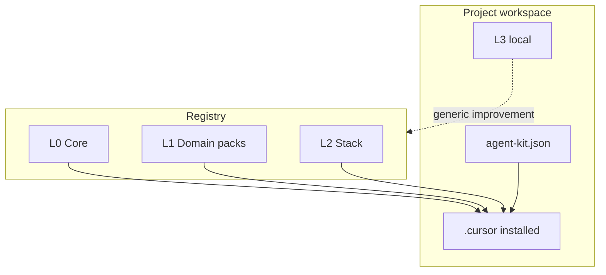

# Layers

Agent Kit sorts every file it can install into four layers, L0 through L3. The layers answer one question: **when the kit updates, what is safe to overwrite and what must be left alone?** This is the model behind the manifest ([agent-kit-manifest.md](agent-kit-manifest.md)) and the `install` / `update` / `diff` commands.

In short:

- **L0** - the base install. Structural things every long project needs (planning, handoff, the git flow, clean-output rules). Always installed; refreshed on update.
- **L1** - optional domain packs (security, DevOps, clean code, …). Installed when you ask; see [domain packs](domain-packs.md).
- **L2** - individual stack skills (n8n, SQL, Node, …). Installed on demand.
- **L3** - your project's own files: plans, notes, custom rules. The kit never overwrites these.

## Why this exists

1. Installing means "write the files this project needs" - not "copy the whole kit repo into it."
2. Updates are safe: your own files (L3) are never overwritten.
3. The base install stays **structural** (the planning/handoff/git loop) instead of becoming a dump of every possible stack rule.

## Layer model

| Layer | Name | Source | Install | Overwritten by `update`? |
|-------|------|--------|---------|---------------------------|
| **L0** | Base install | Kit registry | Always | Yes (unless you set an L3 override) |
| **L1** | Domain packs | Kit registry (packs) | When you ask (`--pack` / `add`) | Yes, for pack members |
| **L2** | Stack skills (plus stack commands/hooks/rules) | Kit registry | On demand or by detection | Yes, for named files |
| **L3** | Your project's files | The project repo | Never from the kit | **Never** |

## Precedence

When two artifacts conflict (same role / same path):

**L3 > L2 > L1 > L0**

- More specific wins (cascade).
- L3 must use a **distinct basename** or an explicit override entry in the manifest - do not silently edit an L0–L2 file in place.
- If a project needs different behavior from L0, either: (a) an L3 override named in the manifest, or (b) propose the change upstream.

## Classification criteria

Use with [coherence-inventory.md](coherence-inventory.md):

| Label | Meaning | Typical layer |
|-------|---------|---------------|
| `core` | Structural loop for any long-running project | L0 |
| `stack` | Depends on language, PM tool, n8n, etc. | L1 pack or L2 skill |
| `obsolete` | Superseded, or works against the human-in-control / clean-output principles | Remove or archive - do not ship |
| `merge` | Duplicate of another SoT path | Keep one SoT; drop the other |

**Tests for L0 (all should pass):**

1. Useful without a specific language or service.
2. Keeps a human in control of production and other risky steps.
3. Shows up in essentially every healthy install ([drift-inventory.md](drift-inventory.md)).
4. Safe to apply always (or with narrow file globs) - never carries product- or org-specific content.

**Fails L0 →** it belongs in a pack (L1) or an on-demand skill (L2).

## Nomenclature

| Kind | Path / id | Notes |
|------|-----------|--------|
| Rule | `.cursor/rules/<name>.mdc` | Prefer kebab-case; structural names without vendor |
| Command | `.cursor/commands/<name>.md` | Slash command = filename without `.md` |
| Skill | `.cursor/skills/<id>/SKILL.md` | `id` = registry skill name |
| Agent | `.cursor/agents/<name>.md` | Optional in L0; many are stack |
| Hook | `.cursor/hooks/*` or `hooks.json` | Prefer IDE-native events |
| Pack (L1) | `packs/<pack-id>/` in registry | Cohesive set of rules+skills+agents+commands+hooks |
| Manifest | `.cursor/agent-kit.json` | Version, packs, L2 list, protected L3 paths |

**Pack ids (initial L1 set):**

`cybersec` · `devops` · `architecture` · `clean-code` · `project-management` · `context-management` · `quality`

## L0 - the base install (always installed)

The minimum structural set every install ships with:

### Rules

| Artifact | Role |
|----------|------|
| `cursor-plan-handoff.mdc` | Plans, phases, HANDOFF |
| `context-guardian.mdc` | Context window / handoff prompt |
| `cursor-skills-git-workflow.mdc` | Staging → prod spine |
| `cursor-skills-general.mdc` | Baseline coding + git conventions |
| `ux-tone.mdc` | Chat tone (not repo voice) |
| `agent-output-hygiene.mdc` | Chat ≠ versioned artifact |
| `docs-professional-standard.mdc` | Inheritable product docs |
| `memory-loop.mdc` | CHECK → ACT → WRITE learnings |

### Commands

| Artifact | Role |
|----------|------|
| `start-project.md` | Onboarding |
| `continue-plan.md` | Resume from HANDOFF (manual mode: one phase per chat) |
| `run-plan-loop.md` | Continuous ticks; status on plan panel; staging per tick |
| `run-plan-orchestrated.md` | Thin orchestrator + Task workers; fallback → loop/manual |
| `handoff.md` | Persist state |
| `summary.md` / `context-status.md` | Orientation |
| `git-staging.md` | Promote to staging (canonical) |
| `git-prod.md` | Promote to main (**explicit confirmation**) |

### Native Cursor hooks (agent runtime)

Soft always-on rules are not enough to stop an agent from burning a whole plan in one chat. L0 therefore ships Cursor-native hooks:

| Artifact | Role |
|----------|------|
| `.cursor/hooks.json` | Manifest: `sessionStart`, `preCompact` (no `stop` follow-up; slash-command HITL owns the turn) |
| `.cursor/hooks/agent/session-plan-guard.py` | Inject HANDOFF excerpt + one-phase hard rules |
| `.cursor/hooks/agent/precompact-handoff.py` | User hint when the IDE compacts context |

Requires `python3` on PATH (standard on macOS/Linux agent hosts). Distinct from git `pre-commit` secrets hooks.

### Autogit (project root)

| Artifact | Role |
|----------|------|
| `autogit/gitupdate.md` | Staging → prod prompts (spine) |
| `autogit/plan-routine.md` | Plan modes: manual / loop / orchestrated; context budget fields |

### Context templates

| Artifact | Role |
|----------|------|
| `.cursor/context/templates/plan.md` | Canonical plan scaffold; optional per-todo `read_scope` / `worker_contract` / `max_ticks` |

Shipped with the kit tree / public sync / `cursor-handoff` template copy. Not re-applied by `agent-kit update` over `.cursor/context/**` (L3-protected session tree).

### Explicitly not L0

- PM tool rules (e.g. ClickUp) → L1 `project-management` or L2
- n8n / SQL / PHP / Node / API skill rules → L2
- Org or product domain rules → L3
- Positioning that removes the human from production/risk decisions → reject

## L1 - Domain packs

Discipline knowledge, stack-agnostic. Each pack installs as a unit.

Membership (members, excludes, SoT paths): **[domain-packs.md](domain-packs.md)** and `registry/packs/<id>/pack.json`.

| Pack | Typical contents |
|------|------------------|
| `cybersec` | Security review skill + security-reviewer agent |
| `devops` | CI/CD / infra rule (`cursor-skills-devops`); git spine stays L0 |
| `architecture` | tech-lead agent + docs-repo skill and agent |
| `clean-code` | clean-code skill + cleancode-refactor agent |
| `project-management` | Optional PM adapters (ClickUp/Jira); plan/handoff stays L0 |
| `context-management` | context-librarian, memory-extractor, context-status |
| `quality` | testing rule + testes-roteiros agent |

Language/SaaS artifacts are **L2**, not pack members (n8n, SQL, Node, …).

## L2 - Stack (registry on demand)

- Skills under `registry/skills/` (and future stack commands/hooks/rules).
- Installed by name (`agent-kit add <skill>`) or detection (`package.json` → node; `*.n8n.json` → n8n).
- Workspace copies of registry skills should dedupe to SoT (see coherence inventory).

## L3 - your project's own files

Only what is unique to the repo:

- Domain rules (`project-context.mdc`, `project-domain.mdc`, `YOUR_PROJECT-*`, …)
- Local skills/commands not in the registry
- `.cursor/HANDOFF.md`, `.cursor/plans/`, `.cursor/memory/`, `.cursor/context/`

**Golden rule:** never hand-edit an installed L0–L2 file to “fix the project”. Override via L3 or contribute upstream.

Protected paths are listed in the manifest so `update` skips them.

## Relation to folder copies

| Status | Contract |
|--------|----------|
| Nested `agent-kit/` (sometimes with `node_modules`) | **Retired** - see [bootstrap.md](bootstrap.md); the CLI or `@install.md` writes `.cursor/` + `autogit/` + manifest |
| Unknown kit version | Recorded in `agent-kit.json` → `version` |
| Core files edited in place | Detected by `diff`; migrate to L3 or contribute upstream |

New installs follow [bootstrap.md](bootstrap.md). To move an existing nested copy off the old model, see [migrate-consumer.md](migrate-consumer.md).
