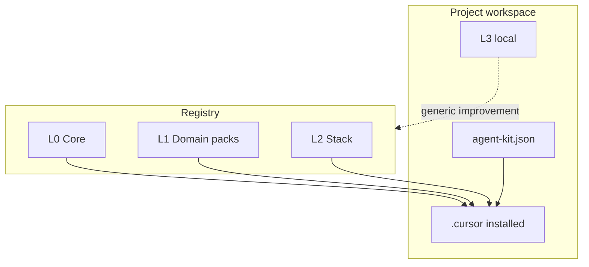

# Layers specification (L0–L3)

Canonical definition of Agent Kit distribution layers. Complements [drift-inventory.md](drift-inventory.md) (what is installed today) and [coherence-inventory.md](coherence-inventory.md) (core | stack | obsolete classification).

**Status:** Phase 0 spec — binding for manifest (`agent-kit.json`), CLI lifecycle, and fleet migration. Manifest schema: [agent-kit-manifest.md](agent-kit-manifest.md) + [schemas/agent-kit.manifest.schema.json](../schemas/agent-kit.manifest.schema.json).

## Goals

1. Stop treating “copy `agent-kit/` into the project” as install.
2. Make upgrades safe: upstream never overwrites project-unique (L3) artifacts.
3. Keep the Core Pack **structural** (HITL, handoff, git spine, hygiene) — not a dump of every stack rule.

## Layer model

| Layer | Name | Source | Install | Overwritten by `update`? |
|-------|------|--------|---------|---------------------------|
| **L0** | Core estrutural | Kit registry / SoT | Always (every install profile) | Yes (unless listed as L3 override) |
| **L1** | Domain packs | Kit registry (packs) | Opt-in by profile / `add` | Yes for pack members |
| **L2** | Stack skills (and stack cmds/hooks/rules) | Kit registry | On demand / detection | Yes for named artifacts |
| **L3** | Local do projeto | The project repo | Never from kit | **Never** |

## Precedence

When two artifacts conflict (same role / same path):

**L3 > L2 > L1 > L0**

- More specific wins (cascade).
- L3 must use a **distinct basename** or an explicit override entry in the manifest — do not silently edit an L0–L2 file in place.
- If a project needs different behavior from L0, either: (a) L3 override named in manifest, or (b) propose upstream change (Phase 5).

## Classification criteria

Use with [coherence-inventory.md](coherence-inventory.md):

| Label | Meaning | Typical layer |
|-------|---------|---------------|
| `core` | Structural loop for any long-running project | L0 |
| `stack` | Depends on language, PM tool, n8n, etc. | L1 pack or L2 skill |
| `obsolete` | Superseded or contradicts HITL / hygiene | Remove or archive — do not ship |
| `merge` | Duplicate of another SoT path | Keep one SoT; drop the other |

**Tests for L0 (all should pass):**

1. Useful without a specific language or SaaS.
2. Aligns with HITL (human gates on prod / risk).
3. Appears as denominator across healthy kit installs ([drift-inventory.md](drift-inventory.md)).
4. Safe to `alwaysApply` or narrow globs — never product/org gossip.

**Fails L0 →** pack (L1) or registry skill (L2).

## Nomenclature

| Kind | Path / id | Notes |
|------|-----------|--------|
| Rule | `.cursor/rules/<name>.mdc` | Prefer kebab-case; structural names without vendor |
| Command | `.cursor/commands/<name>.md` | Slash command = filename without `.md` |
| Skill | `.cursor/skills/<id>/SKILL.md` | `id` = registry skill name |
| Agent | `.cursor/agents/<name>.md` | Optional in L0; many are stack |
| Hook | `.cursor/hooks/*` or `hooks.json` | Prefer IDE-native events |
| Pack (L1) | `packs/<pack-id>/` in registry | Cohesive set of rules+skills+agents+commands+hooks |
| Manifest | `.cursor/agent-kit.json` | Version, packs, L2 list, protected L3 paths |

**Pack ids (initial L1 set):**

`cybersec` · `devops` · `engenharia-arquitetura` · `clean-code` · `gestao-projeto` · `gestao-contexto` · `quality`

## L0 — Core estrutural (always installed)

Minimum set implied by drift denominator + product thesis:

### Rules

| Artifact | Role |
|----------|------|
| `cursor-plan-handoff.mdc` | Plans, phases, HANDOFF |
| `context-guardian.mdc` | Context window / handoff prompt |
| `cursor-skills-git-workflow.mdc` | Staging → prod spine |
| `cursor-skills-general.mdc` | Baseline coding + git conventions |
| `ux-tone.mdc` | Chat tone (not repo voice) |
| `agent-output-hygiene.mdc` | Chat ≠ versioned artifact |
| `docs-professional-standard.mdc` | Inheritable product docs |
| `memory-loop.mdc` | CHECK → ACT → WRITE learnings |

### Commands

| Artifact | Role |
|----------|------|
| `iniciar-projeto.md` | Onboarding |
| `continuar-plano.md` | Resume from HANDOFF (manual mode) |
| `executar-plano-loop.md` | Continuous ticks; status on plan panel; staging per tick |
| `executar-plano-orquestrado.md` | Thin orchestrator + Task workers; fallback → loop/manual |
| `handoff.md` | Persist state |
| `resumo.md` / `context-status.md` | Orientation |
| `git-staging.md` | Promote to staging (canonical) |
| `git-homolog.md` | Legacy alias of staging |
| `git-prod.md` | Promote to main (**explicit confirmation**) |

### Autogit (project root)

| Artifact | Role |
|----------|------|
| `autogit/gitupdate.md` | Staging → prod prompts (spine) |
| `autogit/plan-routine.md` | Plan modes: manual / loop / orchestrated; context budget fields |

### Context templates

| Artifact | Role |
|----------|------|
| `.cursor/context/templates/plan.md` | Canonical plan scaffold; optional per-todo `read_scope` / `worker_contract` / `max_ticks` |

Shipped with the kit tree / public sync / `cursor-handoff` template copy. Not re-applied by `agent-kit update` over `.cursor/context/**` (L3-protected session tree).

### Explicitly not L0

- PM tool rules (e.g. ClickUp) → L1 `gestao-projeto` or L2
- n8n / SQL / PHP / Node / API skill rules → L2
- Org or product domain rules → L3
- Marketing / autonomous-agent positioning that breaks HITL → reject

## L1 — Domain packs

Discipline knowledge, stack-agnostic. Each pack installs as a unit.

Membership (members, excludes, SoT paths): **[domain-packs.md](domain-packs.md)** and `registry/packs/<id>/pack.json`.

| Pack | Typical contents |
|------|------------------|
| `cybersec` | Security review skill + security-reviewer agent |
| `devops` | CI/CD / infra rule (`cursor-skills-devops`); git spine stays L0 |
| `engenharia-arquitetura` | tech-lead agent + docs-repo skill |
| `clean-code` | clean-code skill + cleancode-refactor agent |
| `gestao-projeto` | Optional PM adapters (ClickUp/Jira); plan/handoff stays L0 |
| `gestao-contexto` | context-librarian, memory-extractor, context-status |
| `quality` | testing rule + testes-roteiros agent |

Language/SaaS artifacts are **L2**, not pack members (n8n, SQL, Node, …).

## L2 — Stack (registry on demand)

- Skills under `registry/skills/` (and future stack commands/hooks/rules).
- Installed by name (`agent-kit add <skill>`) or detection (`package.json` → node; `*.n8n.json` → n8n).
- Workspace copies of registry skills should dedupe to SoT (see coherence inventory).

## L3 — Local do projeto

Only what is unique to the repo:

- Domain rules (`project-context.mdc`, `project-domain.mdc`, `YOUR_PROJECT-*`, …)
- Local skills/commands not in the registry
- `.cursor/HANDOFF.md`, `.cursor/plans/`, `.cursor/memory/`, `.cursor/context/`

**Golden rule:** never hand-edit an installed L0–L2 file to “fix the project”. Override via L3 or contribute upstream.

Protected paths are listed in the manifest (Phase 1) so `update` skips them.

## Relation to folder copies

| Status | Contract |
|--------|----------|
| Nested `agent-kit/` (sometimes with `node_modules`) | **Retired** — see [bootstrap.md](bootstrap.md); CLI or `@install.md` writes `.cursor` + `autogit/` + manifest |
| Unknown kit version | `agent-kit.json` → `version` |
| Edited core files in place | Detected by `diff`; migrate to L3 or PR |

Fleet cleanup of existing nested copies is Phase 4. New installs must follow [bootstrap.md](bootstrap.md). See [drift-inventory.md](drift-inventory.md) for offenders and L3 preserve lists.

## Acceptance (Phase 0)

- [x] Layers L0–L3 named with precedence and nomenclature
- [x] L0 draft list grounded in drift denominator + HITL
- [x] L1 pack ids listed; L2/L3 boundaries clear
- [x] Manifest schema (`f1-manifest`) consumes this doc — see [agent-kit-manifest.md](agent-kit-manifest.md)
- [ ] Coherence pass (`f6-coherence`) reclassifies remaining rules into these buckets without contradiction
