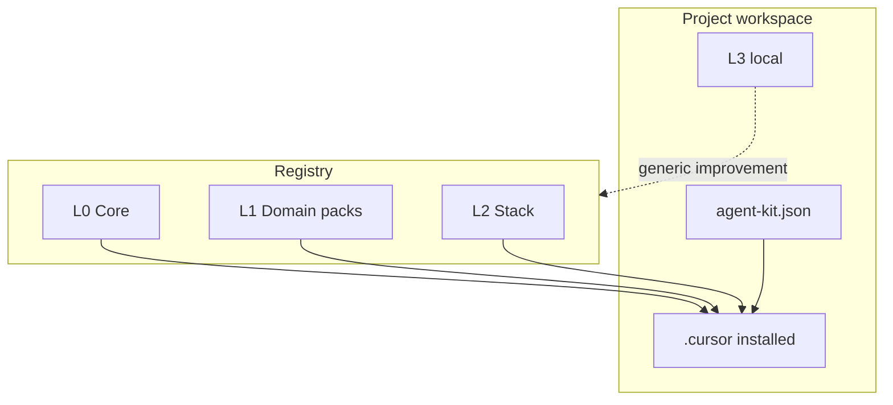

# Layers

Agent Kit sorts every file it can install into four layers, L0 through L3. The layers answer one question: **when the kit updates, what is safe to overwrite and what must be left alone?** This is the model behind the manifest ([agent-kit-manifest.md](agent-kit-manifest.md)) and the `install` / `update` / `diff` commands.

In short:

- **L0** - the base install. Structural things every long project needs (planning, handoff, the git flow, clean-output rules). Always installed; refreshed on update.
- **L1** - optional domain packs (security, DevOps, clean code, …). Installed when you ask; see [domain packs](domain-packs.md).
- **L2** - individual stack skills (n8n, SQL, Node, …). Installed on demand.
- **L3** - your project's own files: plans, notes, custom rules. The kit never overwrites these.

## Why this exists

1. Installing means "write the files this project needs" - not "copy the whole kit repo into it."
2. Updates are safe: your own files (L3) are never overwritten.
3. The base install stays **structural** (the planning/handoff/git loop) instead of becoming a dump of every possible stack rule.

## Layer model

| Layer | Name | Source | Install | Overwritten by `update`? |
|-------|------|--------|---------|---------------------------|
| **L0** | Base install | Kit registry | Always | Yes (unless you set an L3 override) |
| **L1** | Domain packs | Kit registry (packs) | When you ask (`--pack` / `add`) | Yes, for pack members |
| **L2** | Stack skills (plus stack commands/hooks/rules) | Kit registry | On demand or by detection | Yes, for named files |
| **L3** | Your project's files | The project repo | Never from the kit | **Never** |

```mermaid
flowchart TB
  subgraph registry [Registry]
    L0[L0 Core]
    L1[L1 Domain packs]
    L2[L2 Stack]
  end
  subgraph ws [Project workspace]
    M[agent-kit.json]
    C[.cursor installed]
    L3[L3 local]
  end
  L0 --> C
  L1 --> C
  L2 --> C
  M --> C
  L3 -.->|generic improvement| registry
```

## Precedence

When two artifacts conflict (same role / same path):

**L3 > L2 > L1 > L0**

- More specific wins (cascade).
- L3 must use a **distinct basename** or an explicit override entry in the manifest - do not silently edit an L0–L2 file in place.
- If a project needs different behavior from L0, either: (a) an L3 override named in the manifest, or (b) propose the change upstream.

## Classification criteria

Use with [coherence-inventory.md](coherence-inventory.md):

| Label | Meaning | Typical layer |
|-------|---------|---------------|
| `core` | Structural loop for any long-running project | L0 |
| `stack` | Depends on language, PM tool, n8n, etc. | L1 pack or L2 skill |
| `obsolete` | Superseded, or works against the human-in-control / clean-output principles | Remove or archive - do not ship |
| `merge` | Duplicate of another SoT path | Keep one SoT; drop the other |

**Tests for L0 (all should pass):**

1. Useful without a specific language or service.
2. Keeps a human in control of production and other risky steps.
3. Shows up in essentially every healthy install ([drift-inventory.md](drift-inventory.md)).
4. Safe to apply always (or with narrow file globs) - never carries product- or org-specific content.

**Fails L0 →** it belongs in a pack (L1) or an on-demand skill (L2).

## Nomenclature

| Kind | Path / id | Notes |
|------|-----------|--------|
| Rule | `.cursor/rules/<name>.mdc` | Prefer kebab-case; structural names without vendor |
| Command | `.cursor/commands/<name>.md` | Slash command = filename without `.md` |
| Skill | `.cursor/skills/<id>/SKILL.md` | `id` = registry skill name |
| Agent | `.cursor/agents/<name>.md` | Optional in L0; many are stack |
| Hook | `.cursor/hooks/*` or `hooks.json` | Prefer IDE-native events |
| Pack (L1) | `packs/<pack-id>/` in registry | Cohesive set of rules+skills+agents+commands+hooks |
| Manifest | `.cursor/agent-kit.json` | Version, packs, L2 list, protected L3 paths |

**Pack ids (L1 set):**

`cybersec` · `devops` · `engineering-architecture` · `clean-code` · `project-management` · `context-management` · `quality`

## L0 - the base install (always installed)

The minimum structural set every install ships with:

### Rules

| Artifact | Role |
|----------|------|
| `cursor-plan-handoff.mdc` | Plans, phases, HANDOFF |
| `context-guardian.mdc` | Context window / handoff prompt |
| `cursor-skills-git-workflow.mdc` | Staging → prod spine |
| `cursor-skills-general.mdc` | Baseline coding + git conventions |
| `ux-tone.mdc` | Chat tone (not repo voice) |
| `agent-output-hygiene.mdc` | Chat ≠ versioned artifact |
| `docs-professional-standard.mdc` | Inheritable product docs |
| `memory-loop.mdc` | CHECK → ACT → WRITE learnings |
| `git-secrets-safety.mdc` | Never commit without `.gitignore` + secrets checklist (also a cybersec pack member) |

### Commands

| Artifact | Role |
|----------|------|
| `onboard.md` | First-session welcome and setup |
| `start-project.md` | Plan bootstrap |
| `backlog-add.md` | Enqueue plan to HANDOFF Backlog (no Gate B / no activate) |
| `backlog-edit.md` | Edit backlog plan markdown after Ask confirm |
| `backlog-delete.md` | Remove from Backlog + move to `.cursor/plans/archive/` |
| `backlog-cancel.md` | Soft-cancel open to-dos; keep file under `.cursor/plans/` |
| `continue-plan.md` | Resume from HANDOFF (manual mode: one phase per chat) |
| `run-plan.md` | Continuous mode; auto strategy (orchestrated workers / in-session loop / headless); staging per tick |
| `run-plan-all.md` | `/run-plan-all` multi-plan queue: pure orchestrator dispatches one Task per plan; one release per completed plan when Ship auth is `per-plan-release` |
| `run-plan-loop.md` / `run-plan-orchestrated.md` | Deprecated aliases of `run-plan.md` (forced strategy) |
| `handoff.md` | Persist state |
| `summary.md` / `context-status.md` | Orientation |
| `git-staging.md` | Promote to staging (canonical) |
| `git-prod.md` | Promote to main (**explicit confirmation**) |
| `plan-external-review.md` | Manual arm for optional Claude Code post-exhaustion review |
| `plan-review-triage.md` | Triage monitor residuals (Ask: residuals plan / nits / ack) |
| `qa.md` | `/qa` release or bug claim matrix (install journey, tests, hygiene). Playbook: `.cursor/skills/core/qa/`. No new L0 agent. Never `/git-prod` |

Optional external plan review ships with L0 (commands above, templates below, launcher, `config.example.json`) but stays **config-disabled** by default (`externalPlanReview.enabled: false`). Never forces a Claude install. See [external-plan-review.md](external-plan-review.md).

### Skills (core, L0 overlay)

SoT for the apply set: `packages/cli/src/lifecycle/l0.ts`. Factory tree may hold additional core/community/domain skills that are registry-installable and are not in this overlay.

| Artifact | Role |
|----------|------|
| `.cursor/skills/core/hitl-gates/` | Ask labels, numbered-list fallback, tick/intake/queue procedures (`SKILL.md`, redirect stub, three contract pages) |
| `.cursor/skills/core/qa/SKILL.md` | `/qa` playbook (claim matrix, journey, tests, hygiene). Invoke via `/qa`; not an L0 agent |
| `.cursor/skills/core/dashboard-broadcast/SKILL.md` | `/dashboard-broadcast` port, log, and detach notes |
| `.cursor/skills/core/agent-kit-onboard/procedure.md` | Onboard check resolution (one-hop from `/agent-kit-onboard`) |
| `.cursor/skills/core/backlog-add/procedure.md` | Broad Intake detail (one-hop from `/backlog-add`) |
| `.cursor/skills/core/field-report-resolve/procedure.md` | Per-shape locate/check (one-hop from `/field-report-resolve`) |
| `.cursor/skills/core/plan-external-review/procedure.md` | Manual arm / chat-vs-CI (one-hop from `/plan-external-review`) |
| `.cursor/skills/core/plan-review-triage/procedure.md` | Triage steps 1-6 (one-hop from `/plan-review-triage`) |

### Scripts (under `.cursor/`)

| Artifact | Role |
|----------|------|
| `.cursor/scripts/plan-external-review.sh` | Canonical launcher (chat: `--autonomous` background PTY or `--paste-only`; CI: `--print` / `--force`); thin wrapper may exist at `scripts/` |
| `.cursor/scripts/run-plan-all-consolidate.sh` | Safe `/run-plan-all` consolidation apply (dry-run default; `--apply --approved`; drop/archive, queue rewrite, merge checklist); thin wrapper may exist at `scripts/` |

### Native Cursor hooks (agent runtime)

Soft always-on rules are not enough to stop an agent from burning a whole plan in one chat. L0 therefore ships Cursor-native hooks:

| Artifact | Role |
|----------|------|
| `.cursor/hooks.json` | Manifest: sessionStart, preCompact, beforeShellExecution, afterFileEdit, beforeSubmitPrompt (no `stop`; slash-command HITL owns the turn) |
| `.cursor/hooks/agent/*.sh` | Thin adapters that shell out to `agent-kit hook` / `guard` / `validate` (fail-open if CLI missing) |

Native agent hooks need Node + `agent-kit` on PATH (or `node_modules/.bin` / built `packages/cli/dist`). They are separate from git pre-commit hooks: one runs inside the IDE agent loop; the other runs at commit time. Invariants live in the CLI (`agent-kit doctor` reports `hooks: active | degraded`).

### Autogit (project root)

| Artifact | Role |
|----------|------|
| `autogit/gitupdate.md` | Staging → prod prompts (spine) |
| `autogit/plan-routine.md` | Plan modes: manual / loop / orchestrated; context budget fields |

### Context templates and example config

| Artifact | Role |
|----------|------|
| `.cursor/context/templates/plan.md` | Canonical plan scaffold; optional per-todo `read_scope` / `worker_contract` / `max_ticks` |
| `.cursor/context/templates/plan-monitor.md` | Monitor document scaffold for external plan review |
| `.cursor/context/templates/plan-external-review-prompt.md` | Prompt passed to Claude Code for post-exhaustion review |
| `.cursor/context/config.example.json` | Example keys including `externalPlanReview` (`enabled`, `offerOnExhausted`, …) |

Shipped with L0 install (and public sync). Session `config.json`, `current/**`, and `backups/**` stay L3-protected; `update` does not overwrite that session state. Kit templates and `config.example.json` are **not** under the protected blanket (legacy manifests with `.cursor/context/**` are normalized on update). Mission Control may merge allowlisted prefs into session `config.json` via loopback `PUT`/`PATCH /api/config` (see decision `2026-07-26_mission-control-config-write-allowlist.md`); that path does not edit `.cursor/agent-kit.config.json`.

### Explicitly not L0

- PM tool rules (e.g. ClickUp) → L1 `project-management` or L2
- n8n / SQL / PHP / Node / API skill rules → L2
- Org or product domain rules → L3
- Positioning that removes the human from production/risk decisions → reject

## L1 - Domain packs

Discipline knowledge, stack-agnostic. Each pack installs as a unit.

Membership (members, excludes, SoT paths): **[domain-packs.md](domain-packs.md)** and `registry/packs/<id>/pack.json`.

| Pack | Typical contents |
|------|------------------|
| `cybersec` | Security review skill + security-reviewer agent + `git-secrets-safety` (dual with L0) |
| `devops` | CI/CD / infra rule + CODEOWNERS and GitLab CI templates; git spine stays L0 |
| `engineering-architecture` | tech-lead agent + docs-repo skill and agent + ADR / task-brief templates |
| `clean-code` | clean-code skill + cleancode-refactor agent |
| `project-management` | Optional PM adapters (ClickUp/Jira); plan/handoff stays L0 |
| `context-management` | context-librarian, memory-extractor, context-status, context-pack template |
| `quality` | testing rule + test-suites agent |

Language/SaaS artifacts are **L2**, not pack members (n8n, SQL, Node, …).

## L2 - Stack (registry on demand)

- Skills under `registry/skills/` (and future stack commands/hooks/rules).
- Installed by name (`agent-kit add <skill>`) or detection (`package.json` → node; `*.n8n.json` → n8n).
- Workspace copies of registry skills should dedupe to SoT (see coherence inventory).

## L3 - your project's own files

Only what is unique to the repo:

- Domain rules (`project-context.mdc`, `project-domain.mdc`, `YOUR_PROJECT-*`, …)
- Local skills/commands not in the registry
- `.cursor/HANDOFF.md`, `.cursor/plans/`, `.cursor/memory/`, `.cursor/context/`

**Golden rule (overlay trees):** prefer not to hand-edit kit-owned files under `.cursor/agents/`, `.cursor/skills/`, `.cursor/commands/`, `.cursor/hooks/`, or `.cursor/scripts/` to “fix the project”. Those trees use the consumer overlay: local drift is preserved (`preserved-customized`) via the managed-content ledger, and `update` names each preserved file. For other L0–L2 paths (including pack `rule` members under `.cursor/rules/`), in-place edits are still overwritten on `update`; use a distinct L3 basename, an explicit manifest `overrides` entry, or contribute upstream.

**Consumer overlay (agents / skills / commands / hooks / scripts):** user-added basenames under `.cursor/agents/`, `.cursor/skills/`, `.cursor/commands/`, `.cursor/hooks/`, and `.cursor/scripts/` survive `update` (they are not in the apply set unless a pack/skill targets them). Kit-owned files in those trees that diverge from the managed-content ledger are preserved (`preserved-customized`) instead of silent overwrite; unedited kit files still refresh. The pre-commit secrets hook and the agent hooks are in this overlay: a consumer that widens `check-secrets.sh` keeps its widening, and the apply prints `! path` plus where the change belongs (`agent-kit diff`, `agent-kit contribute`, or a single-path `protected` pin). Pack rules under `.cursor/rules/` are **not** in this overlay and still clobber on drift. Do not blanket-protect `.cursor/agents/**` (or skills/commands/hooks/scripts) in `protected` — that blocks pack / `agent-kit add` installs and forfeits upstream fixes for the whole tree; pin one path when one file must never refresh. See decision `2026-07-29_consumer-l0-overlay-agents-optional.md` (amended 2026-09-10).

Protected paths are listed in the manifest so `update` skips them.

## Read budgets and laziness

Every layer answers "safe to overwrite?" (above). A separate, size-oriented question sits alongside it: **when an agent operates this kit, does it read only what the current command needs, or does it pay for the whole tree?** Host tools that read a file in one call have their own limits (a line-count window, a byte cap, a per-line truncation length) that are outside the kit's control; the only lever the kit has is keeping each file inside those limits so a read never needs a second call.

**Always-on** (loaded every session, no command involved):

- The 10 `alwaysApply: true` L0 rules under `.cursor/rules/` (see the Rules table above).
- `HARD_RULES` (`packages/cli/src/hooks/hard-rules.ts`), injected by the SessionStart hook. It is the **only** always-on text a Claude Code session receives — `.cursor/rules/*.mdc` is Cursor-native and nothing mirrors rules into `.claude/`. A Cursor session pays for both; a Claude Code session pays for `HARD_RULES` only.
- A field-priority excerpt of `.cursor/HANDOFF.md` (machine fields such as `Run queue` / `Queue cursor` / `Queue status` / `Queue outcomes` survive first; then a 60-line / 12 KiB cap). See ADR `decisions/2026-09-23_memory-index-changelog-growth-contracts.md`.
- **Parent-workspace bleed (operator / factory):** if the IDE opens a parent folder (or multi-root workspace) that also has `.cursor/rules`, those rules load beside kit alwaysApply. Prefer opening this repo root alone. The kit does not delete out-of-repo rules (ADR `decisions/2026-09-23_session-starter-tax-kit-vs-operator.md`).
- **Operator MCP plugins:** Hostinger, Figma, Postman (and similar) namespaces are IDE plugins. The kit ships no `mcp.json` and invents no deny-list that cannot bind host plugins.
- **Agent catalog:** `.cursor/agents/` bodies are always listed by Cursor today; kit lever is shorter descriptions only (no host lazy-list API).

**Loads on command** (one hop, only when that command runs):

- A consumer-L0 command's own body (`.cursor/commands/<name>.md`).
- Its per-command skill procedure page, when the command's own contract needs more than a stub holds (for example `.cursor/skills/core/hitl-gates/run-plan-tick-contract.md` for `/run-plan`, or `.cursor/skills/core/backlog-add/procedure.md` for `/backlog-add`'s Broad Intake detail). The command stub links directly to its own page — never through an intermediate index file, so the hop count from slash to operational procedure stays at one.
- The kit-wide HITL contract (`.cursor/skills/core/hitl-gates/SKILL.md`): exact Ask labels, the numbered-list fallback, and the `HITL_GATE`/`HITL_REPLY` sentinel format, shared across commands and linked from each one.

**Loads on glob** (Cursor-native, matched by file pattern, never always-on):

- The 15 globs-lazy rules under `.cursor/rules/cursor-skills-*.mdc`.

**Budgets** (bytes, lines, and longest line only — never a token count; a token figure is a harness-internal detail the kit cannot pin or verify across hosts) are set per file class in `decisions/2026-09-20_contract-read-budget-and-laziness.md` and enforced as CI tests in `packages/cli/src/docs/size-budgets.test.ts`. In short: a consumer-L0 command stays under 150 lines / 8 KiB / 700 characters per line; its one-hop skill page under 250 lines / 10 KiB (or, for the handful of commands whose full procedure genuinely does not fit a stub-sized page, 400 lines / 48 KiB); the always-loaded classes (`alwaysApply` rule, globs-lazy rule, `.claude` command adapter) stay far smaller since every byte there is paid on every matching session. A split that only relocates bytes without cutting real duplication — as happened once (`#901`, `b142fdd`) — is a regression these tests catch; the numbers above are enforced, not aspirational.

## Relation to folder copies

| Status | Contract |
|--------|----------|
| Nested `agent-kit/` (sometimes with `node_modules`) | **Retired** - see [bootstrap.md](bootstrap.md); the CLI or `@install.md` writes `.cursor/` + `autogit/` + manifest |
| Unknown kit version | Recorded in `agent-kit.json` → `version` |
| Core files edited in place | Detected by `diff`; migrate to L3 or contribute upstream |

New installs follow [bootstrap.md](bootstrap.md). To move an existing nested copy off the old model, see [migrate-consumer.md](migrate-consumer.md).
